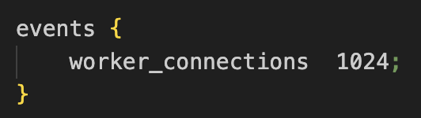

Nginx

/opt/homebrew/etc/nginx/nginx.conf

- open source web server software
- web server serve web content to browser

reverse proxy, load balancing, and caching

for backend developers

network requests from browser to server to get content

- this is an example of a reverse proxy
- browser makes request to nginx then request to server then response back to browser

Why do you need nginx?

- sometimes the server gets too many requests

- load balancer example
- client sends request to nginx which forwards the request to an available server

- website http or https
- https - encrypting data that it's being sent and returned
- problem when you have multiple servers, encrypting every server

- can have encryption at nginx instead of at server to fix that issue

lots of key value pairs in nginx conf

this is a context

http context defines http server, and have directives that will define it

dockerfile from express
https://medium.com/@muhammadnaqeeb/dockerizing-a-node-js-and-express-js-app-9cb31cf9139e

- we want to round robin the docker servers
# nginx-basics
